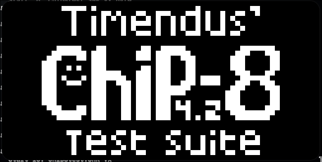

# Chip8 emulator


A lightweight CHIP-8 emulator written in modern C++ with CMake build system.

<p align="center">
  
</p>

## Dependencies

- C++17 compatible compiler (GCC, Clang)
- CMake 3.16 or newer
- SDL3 library

### Install Dependencies

**Arch:**
```bash
sudo pacman -S sdl3
```

### Building
```bash
git clone git@github.com:blariise/chip8.git
cd chip8
cmake -S . -B build
chmod +x chip8.sh
./chip8.sh
```

### Usage
```bash
./chip8.sh <rom_file>
```
